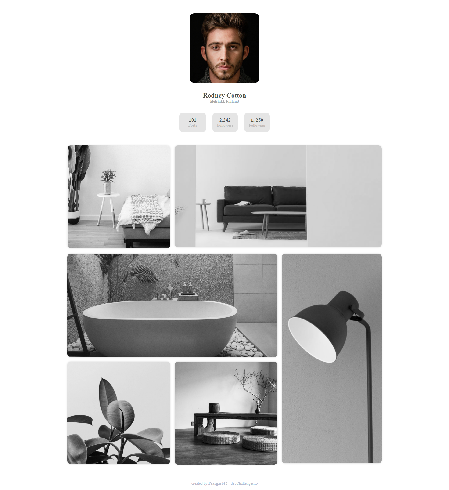

<!-- Please update value in the {}  -->

<h1 align="center">{My Image Gallery}</h1>

   Solution for a challenge from  <a href="http://devchallenges.io" target="_blank">Devchallenges.io</a>.

  <h3>
    <a href="https://{your-demo-link.your-domain}">
      Demo
    </a>
     | 
    <a href="https://{your-url-to-the-solution}">
      Solution
    </a>
     | 
    <a href="https://devchallenges.io/challenges/gcbWLxG6wdennelX7b8I">
      Challenge
    </a>
  </h3>

<!-- TABLE OF CONTENTS -->

## Table of Contents

- [Overview](#overview)
  - [Built With](#built-with)
- [Features](#features)
- [Contact](#contact)
- [Acknowledgements](#acknowledgements)

<!-- OVERVIEW -->

## Overview

Created this beautiful and responsive 'My Image Gallery' using HTML and CSS. Used CSS grids and flexbox to make this webpage responsive.

### Built With

- HTML
- CSS

## Features

This application/site was created as a submission to a [DevChallenges](https://devchallenges.io/challenges) challenge. The [challenge](https://devchallenges.io/challenges/gcbWLxG6wdennelX7b8I) was to build an application to complete the given user stories.

Challenge: Create a static page with HTML and CSS following the designs. You can give it your personal styles by using different images or text. Don’t look at the existing solution. Fulfill user stories below

User story: I can see a page following the given design

## Acknowledgements

- [Steps to replicate a design with only HTML and CSS](https://devchallenges-blogs.web.app/how-to-replicate-design/)
- [CSS Grids](https://developer.mozilla.org/en-US/docs/Learn/CSS/CSS_layout/Grids)

## Contact

- GitHub [@Psargar616](https://{github.com/your-usermame})

